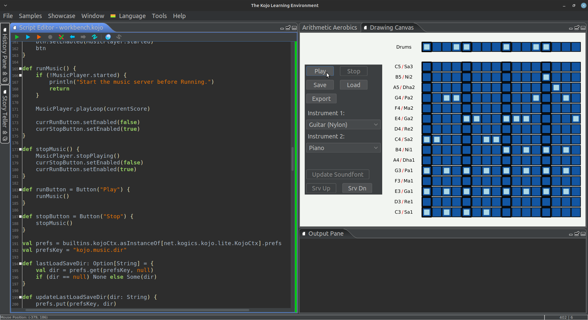

### Experiments in Music with [Kojo](https://www.kojo.in)...

To quickly get going with kojo-music, head on over to the [Release](https://github.com/litan/kojo-music/releases/tag/poc) page. 

The basic goals of the project (subject to refinement as we go along) are to:
* Provide music as a rich area for children to learn core 21st century skills via coding.
* Enable children to have fun with music as creators and composers - via coding.
* Enable the usage of Kojo/coding as a new kind of musical instrument.

Digging a little deeper into the above, here are some essential skills that kids can learn with kojo-music, and examples of how they can be learned:
* Critical thinking - by reproducing a song that they like.
* Problem solving - by getting around the obstacles in trying to do the above.
* Attention-fullness (and focus) - while identifying exactly where their reproduction (of the song that they like) is going wrong in their composition.
* Creative thinking - by composing a new piece of music.
* Design thinking - by composing a new piece of music for a given situation.
* Communication skills - by doing live performances using Kojo as a musical instrument. 
* A Rootedness and Pride in India (for children in India) - by gaining an appreciation for the intricasy and richness of Indian Classical Music, getting familar with Ragas, doing compositions, and getting easy access to traditional learning for Indian Classic Music - for further enrichment of their lives and the strengthening of the music tradition.
* Computational thinking - by gaining an appreciation for the beauty of the code (and the thinking process behind the code) that allows one to generate intricate pieces of classical music via coding. 

Now continuing with the broad set of goals...
* Get children going with composing nice sounding music via an easy to use (GUI based) [music workbench](samples/workbench.kojo), and in the process learning basic music theory.
* Enable the export of the code behind the music from the workbench - to get children familiar with how the music (in the workbench) is related to the code that generates it.
* Get children coding with declarative music.
* Provide children an exciting area (i.e. music) to apply math and play with mathematical ideas - as they compose, generate, and play music.
* Support both [Indian swaras](samples/examples/ons.kojo) and [Western notes](samples/examples/score1.kojo).
* Enable the creation of [infinitely long generative music](samples/examples/score_dyn.kojo).
* Provide rich support for generative music with ragas (coming soon).
* Provide support for live-coding of music (where a new run of a modified program gently modifies the running music)(coming soon).

kojo-music uses Alda (https://alda.io) as its music server (see music server [source code](https://github.com/litan/alda/tree/master/player)).

kojo-music also uses the [FluidR3 soundfont](https://repo1.maven.org/maven2/org/bitbucket/daveyarwood/fluid-r3/0.1.1/fluid-r3-0.1.1.jar).

Below is a screenshot of the music workbench. And [here's a video](https://vimeo.com/748282140) of a tune playing in the workbench.

